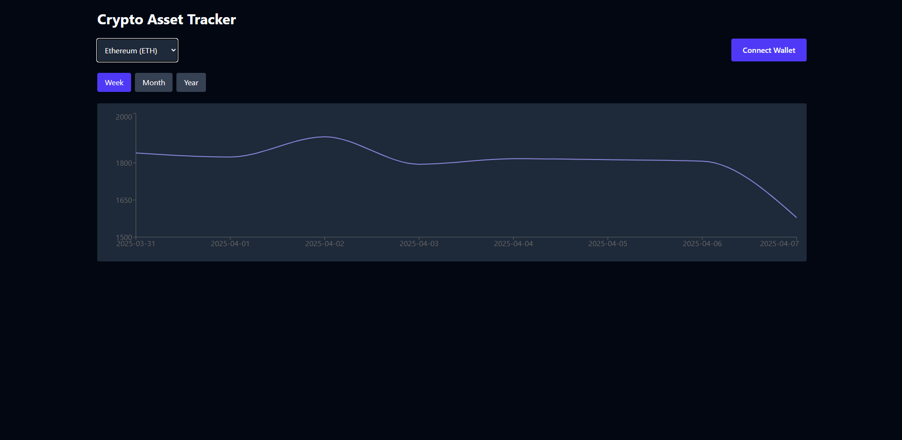
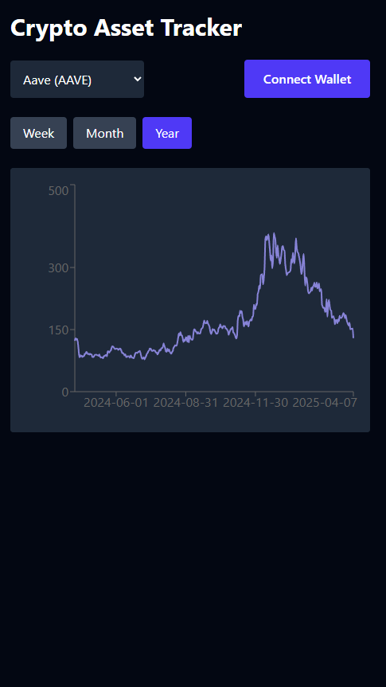
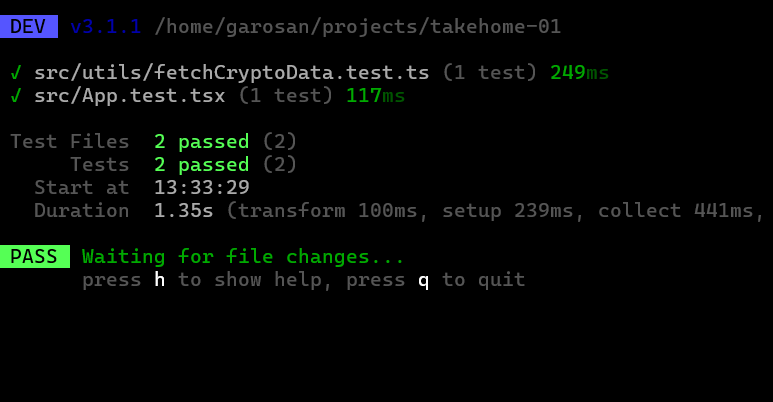

# 📈💸 Crypto Asset Tracker

Responsive frontend web app to track the performance of 5 crypto assets over the past **Week**, **Month**, and **Year**, using CoinGecko's public API and local caching.

## 💻 Tech Stack

I used the following stack:

- Vite
- React
- TypeScript
- Redux-toolkit
- Tailwind CSS
- Recharts for charting
- Vitest + react-testing-library

---

## 🚀 Features

- ✅ Select from major crypto assets (BTC, ETH, ARB, AVAX, OP)
- ✅ View performance charts for last 7, 30, or 365 days
- ✅ Dynamically scaled Y-axis for clean visualization
- ✅ Caches fetched data in `localStorage` (expires after 1 hour)
- ✅ Clean UI with Tailwind & component-based architecture
- ✅ Written in TypeScript with clear logic separation
- ✅ Includes one UI test and one logic test (Vitest + RTL)
- ✅ Wallet connection via MetaMask, Rainbow, etc. (testnets only)

---

## 📦 Setup

```bash
git clone git@github.com:garosan/crypto-asset-tracker.git
cd crypto-asset-tracker
npm install
```

Copy environment variables (in this case, only the CoinGecko public API URL which is included in the example file)

```bash
cp .env.example .env
```

---

## 🏃 Run the app

```bash
npm run dev
```

Then open: [http://localhost:5173](http://localhost:5173)

---

## 🧪 Running Tests

Simply run:

```bash
npx vitest
```

---

## 📷 Screenshots

Desktop view:
<br>

<br>
Mobile view:
<br>

<br>
Tests:
<br>

